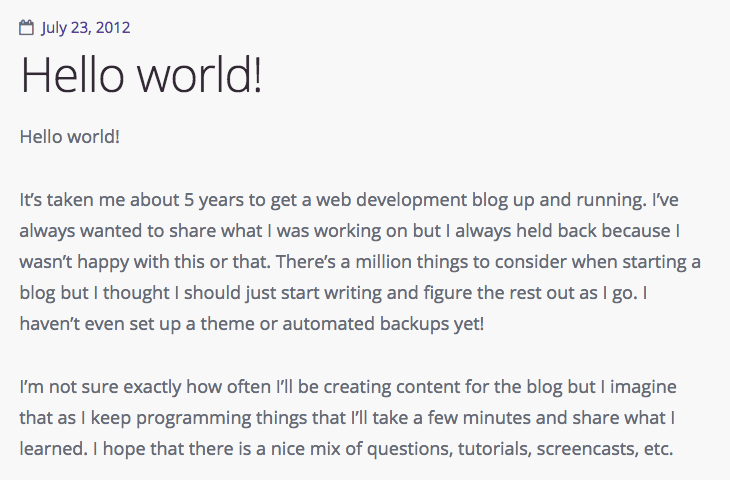
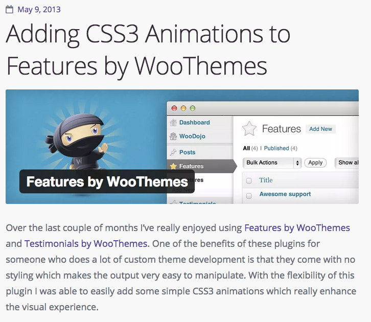
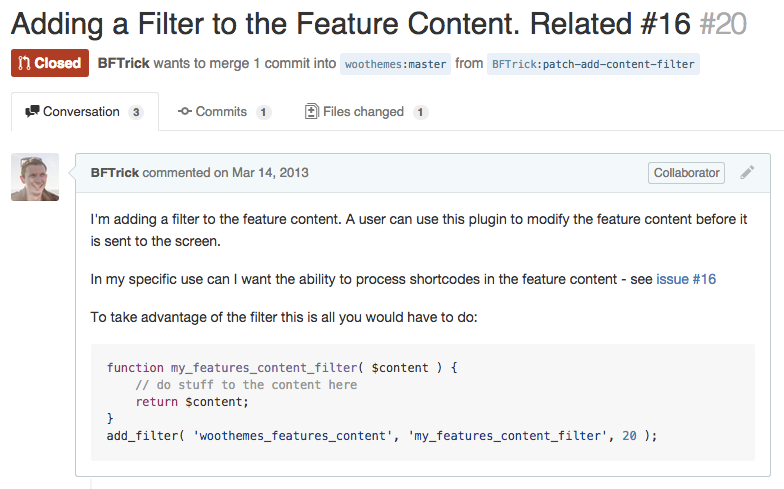
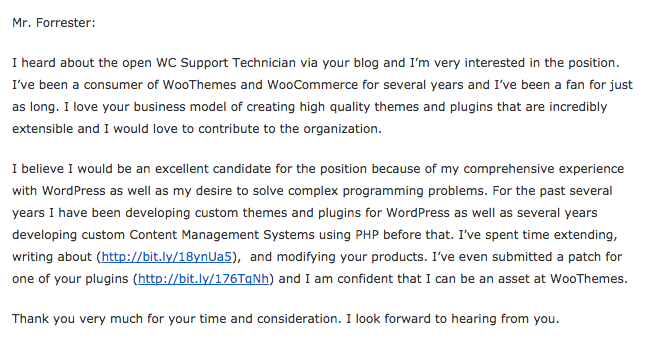
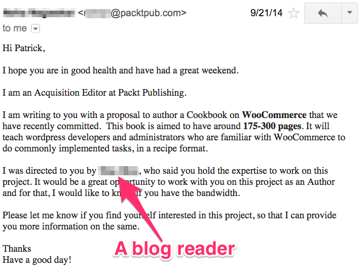
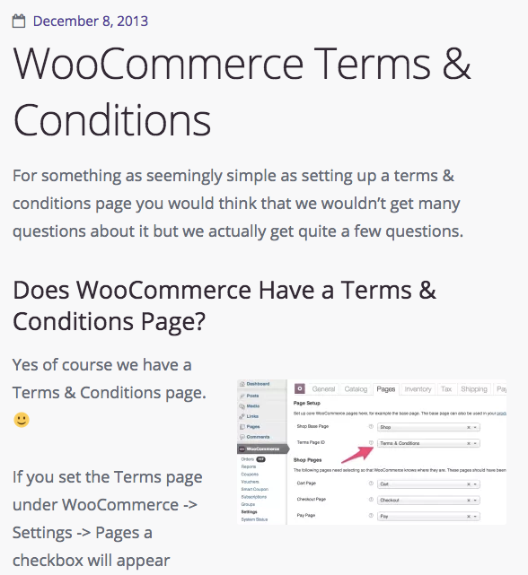
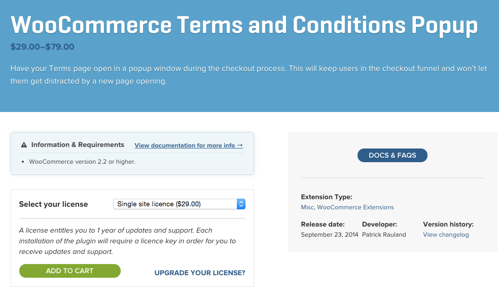
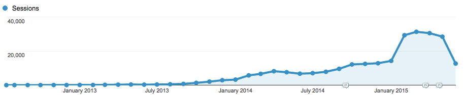

# How My *Blog* Got Me
# a *Job* & a *Book Deal*

### Patrick Rauland
### @BFTrick

---

# Problem: Being *Unknown*

^ You could be the foremost expert in your field but if people don't know you exist it doesn't matter.

^ Wouldn't it be great if there was a way people could find you online?

^ Wouldn't it be great if there was a tool out there that could help you publish content so that people can find you?

^ Let's say people do find you. What happens next?

---

# Problem: Proving *Authority*

^ Prove that you're an expert at something.

^ Flip side of proving authority and that is that some people may not want you. And that's actually a good thing. Before someone builds a store I always encourage them to think about how they're going to get traffic to their site. And I always encourage them to start small and add more features as they go.

^ For many people this strategy is great. But for some they want to have a massive launch and they just want me to build the site right now. That's great but I don't want to be their web developer. I want to build long term relationships with clients and those clients are the ones that think about where they're going to get traffic. They're not the ones who just 'ship it' and hope for the best.

^ Everytime I run avoid one of these people it saves me time.

^ Wouldn't it be great if there was a way you could publish articles that share your expertise with the world?

---

# Problem: *Ideas* are *lost* and *forgotten*

^ too many things floating around in your head.

^ too many things undocumented

^ if you're a designer how many logos do you create that the client doesn't use?

^ If you're a developer how many times have you customized a contact form?

^ Wouldn't it be great if there was a platform where you can publish all of your ideas and potential customers can find them with a google search?

---

# Solution: Blog

^ Easy way for people to find you

^ You will be seen as an authority on the topic. If you've been blogging about logo design for two years. And another designer has a few items in their portfolio they show to clients. Who do you think the client will choose?

^ And this is the place to document everything. Document the end product, document the process, and document the overall effect on the business

---

^ 2012 started blog

^ 198 posts to date

^ I chose a terrible domain name. But what's important is that I chose one and succeeded regardless.

^ While we're on the topics of domain names just use your name.

^ The original intention was to document what I was doing. Things I was learning, conferences I went to, and presentations I made. My blog is quite different today and that's because I now have three years of experience writing a blog and I know what I like, what my audience likes, and what posts bring in the most leads.

^ This would have been impossible to know ahead of time. You just have to start blogging and see what works and what doesn't.

---

# How I Got a *Job*

^ May 2013 wrote post about WooThemes product; specifically about the features plugin.

---

^ good for two reasons. Learn, get feedback, show authority

^ By forcing myself to write down how I made these modifications to a plugin I understood it better.

^ This catapulted me forward and I started sending in GitHub submissions

---

^ Just before that post I was getting good enough at developing to customize plugins. When I noticed that a WooThemes plugin was missing a filter I added it myself.

^ Rather than customize the plugin and create my own customized version I added it to the core plugin so I could use it in all future projects

---

^ One day after after writing that post I got an email saying that WooThemes was hiring.

^ I wrote my cover letter: mentioned the blog post I just showed you and the pull requests to their software.

^ The cover letter was only two paragraphs words long. And it really didn't contain much substance in terms of the words on the page. But it did contain substance in what I've done.

^ By blogging about what I've done I don't have to prove myself in a cover letter. I can instead include two links

^ In June 2013 I was officially hired by WooThemes and I was there for two whole years before we were acquired by Automattic.

---

# WooCommerce Support Ninja

^ For the first year working for WooThemes I'm a Support Ninja. And in that role I answered thousands of questions. Some of which were actually quite interesting.

^ How can I only ship to the continental US?

^ How can I export my subscriptions?

^ How can I add social media icons to product pages?

^ etc

^ Many questions were out of scope. They were good quetions but if we didn't have a solution for social media icons we would say something like "add it to our ideas board". Which sounds nice but there are 2,000+ ideas on the ideas board.

^ I went above and beyond by taking an hour each day answering some of these questions. Sometimes writing code or sometimes just showing people how to use a 3rd party plugin.

^ All of these helped WooThemes customers by going above and beyond, they helped me learn how to write, and little did I know that blog posts wrote in 2013 would attract a publisher in 2014.

---

# Get *Published*

---

^ The approval process was simple. They said they wanted a book of 175-300 pages, I created an outline for the book, and then I signed the contract.

^ Much better than taking learning how to submit a book proposal. For a book proposal you need a cover letter, a table of contents, an overview, your target market, competitive analysis, your credentials, a marketing plan, and a sample chapter.

^ that's a lot of work that I'm glad I skipped. Proving your authority on your blog is one of the best things you can do. It will come up over and over again.

^ From start to finish it took 6 months

^ the book has 90 recipes. I took a couple of my most popular blog posts and put them into the book. About 10% of the book was done before I even started.

---

# Get *Feedback* From Your Community

^ There's another story I want to talk about today. And that's getting feedback from your community.

---

^ At the end of 2013 I wrote a post about The Terms and Conditions feature in WooCommerce. I mentioned one of my gripes that the T&Cs don't open in a popup. I hate the idea that someone could open your T&Cs in a new window and then be distracted and never come back to the checkout so I wrote about it.

^ And in the post I told people to email me if they liked that idea.

^ Well over the next couple months I heard from a number of people that this is exactly what they're looking for.

^ I emailed back and forth with a few of those people to create a tiny little popup plugin for the WooCommerce Terms & Conditions.

---

^ In 2014 I launched it and since then I've had 400+ sales which turned into a really lucrative side project.

^ The lesson here is that without the blog I wouldn't have known that people were looking for this. I could have written a piece of software and no one would have bought it.

^ If you already have an audience it's really to ask people to do something for you.

---

# Coming Soon

^ From this same platform I said, "huh I wonder how hard it is to create a video course. I've written dozens of WooCommerce articles and a book. How hard could it be?"

^ I contacted a really popular video company shared my site and my book and they said yes. So in the next month or two I'll be able to share some new WooCommerce training via video.

---

# Problems

^ let's go back to those problems. No one knowing you, you have lots of great ideas but can't seem to remember them when you need them,  having no authority if they do know you.

^ all of these can be solved with a blog.

^ an hour a day, an hour a week, an hour a month, or an hour a year. It all adds up eventually.

---

^ I never showed my stats and I think it's worth a quick look just for reference.

^ Started in July 2012.

^ Didn't get 1,000 monthly visitors until October 2013 (15 months later)

^ Didn't get 10,000 monthly visitors October 2014 (12 months)

^ 250,000 unique visitors over the lifetime

^ Writing content and building a following is the long game. There isn't anything quick or easy about this. It takes endurance.

---

# Just *Write*

^ some of my "throw away" posts, the posts that I didn't really like but decided to publish anyway because I couldn't figure out how to make it better are some of my best posts

^ TODO screenshot of why I use a macbook air for web development

^ I just XXXX visits a month from that post

---

# Forget *Design*

^ My friend Michael will probably kill me for this but forget design.

^ If you're just getting started focus on writing. I used the default grey TwentyTwelve theme for probably 5-6 months before looking for a better theme. Just wasn't important and it wasn't hurting me.

---

# Forget SEO

^ Don't worry about SEO. Write good content first. If people link to it it will be found in search engines.

^ Once you get 100,000 people a month then you can spend time tinkering with SEO.

---

# Questions?

### @BFTrick
